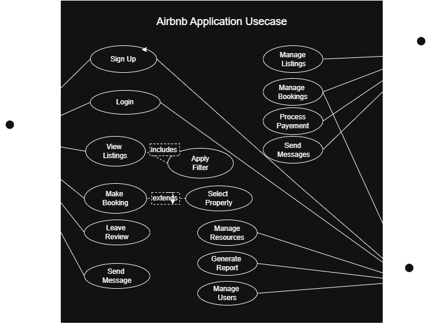

# 🏡 Airbnb-Like Booking Platform – Features & Functionalities

This application is a simplified clone of Airbnb, enabling users to list, book, and review properties. It supports three main user roles: **Guest**, **Host**, and **Admin**, each with distinct capabilities.

---

## 🌟 Use Cases 
The following diagram visualizes the usecases of the system:

### 👤 Guest Features
- ✅ Account registration and login
- 🔍 Search for properties based on location and price
- 📖 View detailed property listings
- 📅 Book and cancel reservations
- 💳 Make secure payments
- 💬 Communicate with hosts via messaging
- ⭐ Leave reviews and ratings
- 👤 Edit personal profile and view booking history

---

### 🏠 Host Features
- ✅ Host account creation and management
- 🏘️ Create, update, or delete property listings
- 📆 Manage availability and booking requests
- 💬 Communicate with guests
- 📊 View reservation and payout history
- ⭐ Respond to reviews

---

### 🛠️ Admin Features
- 🧑‍💼 Manage users (guests and hosts)
- 📋 Approve or suspend property listings
- 🛑 Monitor and resolve disputes
- 📊 View analytics and system logs
- 💵 Manage refunds and payments
- 🧹 Moderate reviews and messages

---

